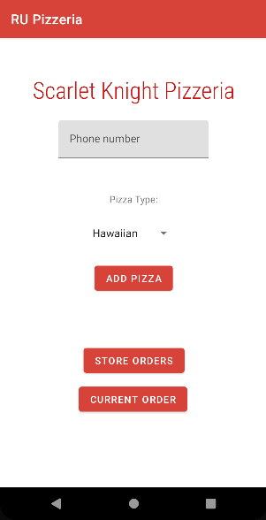
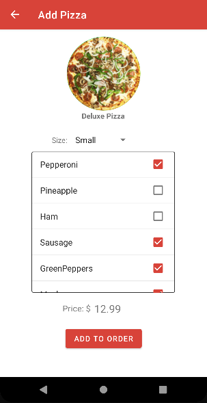

# RU Pizzeria

This was a team-based project that a friend and I created for school. It simulates a pizza-ordering app on Android devices.

In order to use it, you need to have Android Studio installed. From there, you have to import this project through the following steps:

`File - New - Project from Version Control...`

A menu should open up where you can select projects from GitHub. Log in to your GitHub account and select this directory. It should import the project.

To see the project in action, you need to run an **AVD**, or **Android Virtual Device**. You can go to `Tools - Device Manager` and choose `Create Device`. The device used in testing was a **Pixel 3**, with the **R** API.

From there, just start up the AVD, and it should open!

## Screenshots

